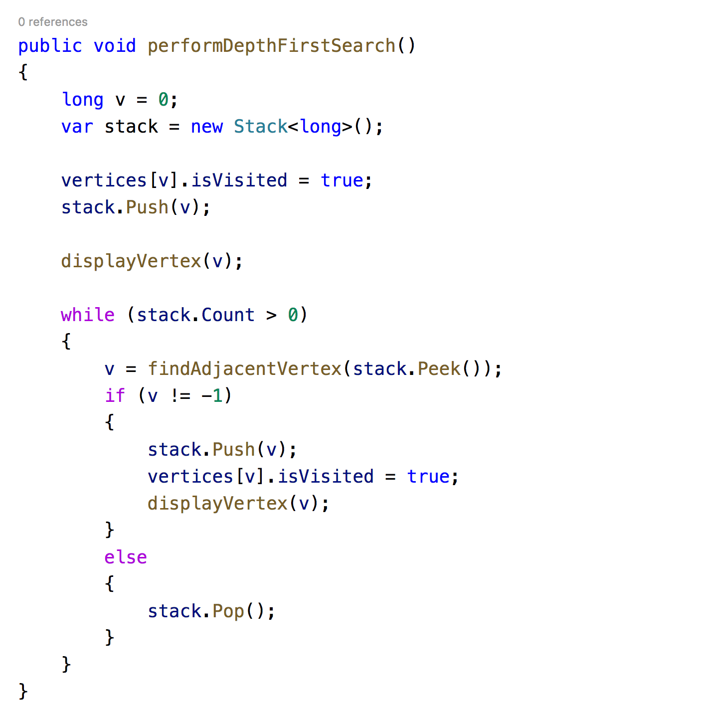

# DFS of Graph

DFS involves following a path from **source vertex** to **adjacent vertex** until there are no other vertex left to visit.

#### Steps

* Start with source vertex, push it into stack, mark it visited and display it.
* Now peek the stack and look for adjacent vertices.
* If found push it into stack, mark it visited and display it.
* If not, then pop up from stack and again repeat step 2.
* Repeat till stack is empty.

Let’s start with implementing method for finding next adjacent vertex for the given vertex.  
We will use edges matrix to determine already visited and connected vertices.

Finally, implement method to perform DFS.

