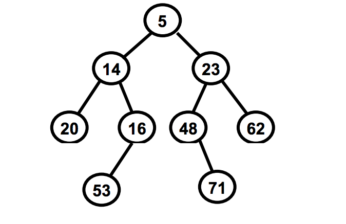

# Min Heap

It is a binary tree in which each node is less than or equal to its children. This data structure is helpful to get min element in O\(1\) time complexity. We use array to keep those elements.



```javascript
class MinHeap {
    constructor(size) {
        this.heapSize = size;
        this.heap = [];
    }

    getParentIndex(index) {
        return Math.floor((index - 1) / 2);
    }

    getLeftIndex(index) {
        return 2 * index + 1;
    }

    getRightIndex(index) {
        return 2 * index + 2;
    }

    getMinElement() {
        return this.heap[0];
    }

    insertElement(value) {
        if (this.heapSize >= this.heap.length) {
            this.heap.push(value);

            let lastIndex = this.heap.length - 1;
            let parentIndex = this.getParentIndex(lastIndex);

            while (this.heap[parentIndex] > this.heap[lastIndex]) {
                this._swap(parentIndex, lastIndex);

                lastIndex = parentIndex;
                parentIndex = this.getParentIndex(parentIndex);
            }
        } else {
            console.warn('heap size limit reached');
        }
    }

    removeRoot() {
        if (this.heap.length === 0) {
            console.warn('heap does not contain any element');
        }

        const lastIndex = this.heap.length - 1;
        this.heap[0] = this.heap[lastIndex];
        this.heap.splice(lastIndex, 1);

        this._heapify(0);
    }

    _hasValue(value) {
        return value !== undefined;
    }

    _swap(indexOne, indexTwo) {
        const temp = this.heap[indexOne];
        this.heap[indexOne] = this.heap[indexTwo];
        this.heap[indexTwo] = temp;
    }

    _heapify(index) {
        const leftIndex = this.getLeftIndex(index);
        const rightIndex = this.getRightIndex(index);

        if (index > this.heap.length) {
            return;
        }

        if (this._hasValue(this.heap[leftIndex]) &&
            this._hasValue(this.heap[rightIndex]) &&
            this.heap[leftIndex] < this.heap[rightIndex]) {
            this._swap(index, leftIndex);
            this._heapify(leftIndex);
        } else if (this._hasValue(this.heap[rightIndex]) && this.heap[rightIndex] < this.heap[index]) {
            this._swap(index, rightIndex);
            this._heapify(rightIndex);
        } else if (this._hasValue(this.heap[leftIndex]) && this.heap[leftIndex] < this.heap[index]) {
            this._swap(index, leftIndex);
            this._heapify(leftIndex);
        }
    }
}
```

