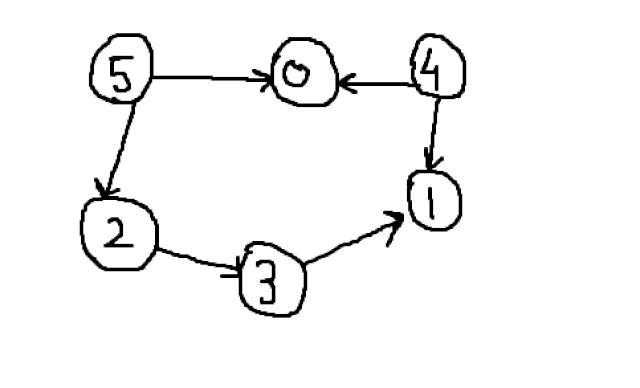
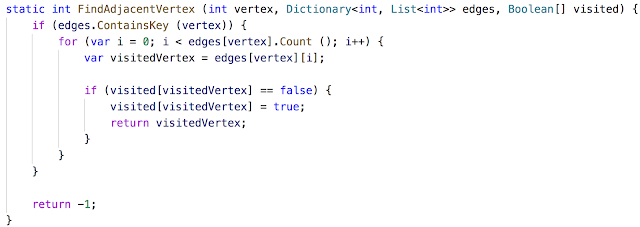
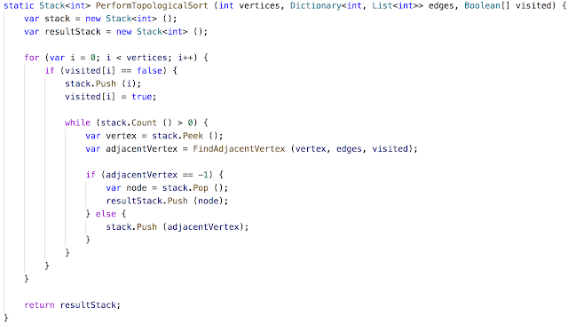

# Topological Sort

Topological sorting in a directed graph is linear ordering of the vertices, such that for every directed edge from **u** to **v**, vertex **u** will come before vertex **v**.  
  
**Applications**  
  
****1. Executing task based on dependency, like our build system.  
2. Scheduling tasks which are dependent.

> **Topological sort will only work on directed acyclic graphs.**

**Algorithm**

1. Pick one vertex, mark it visited and look for its adjacent vertices. 

2. Push just found adjacent vertex into the main stack. 

3. Once no more adjacent vertex is found for the current vertex, pop it out from the main stack and push it into another stack \(result stack\). 

4. Now, pick other vertex which is not visited yet and repeat steps 1, 2 and 3.  
  
**Consider this example**  
  
****Let's say you are given 6 vertices with 6 edges :-  
5, 0, 5, 2, 2, 3, 3, 1, 4, 1, 4, 0  
  
These are 6 pairs, where integer u,v represents edge from u to v. Topological order for the same will be 

5, 4, 2, 3, 1, 0  
  

> **Remember, there can be multiple topological sort order of a graph.**

