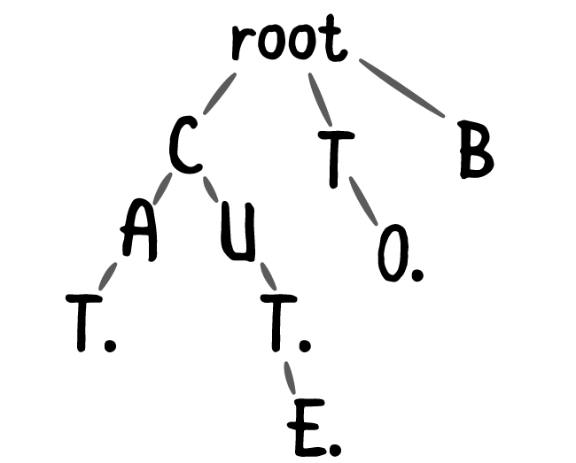

# Trie

A **trie** is a tree like data structure whose nodes store the letters of an alphabet. By structuring the nodes in a particular way, words and strings can be retrieved from the structure by traversing down a branch path of the tree - [_source wikipedia_](https://en.wikipedia.org/wiki/Trie)\_\_




**Inserting a node into the given trie**

```javascript
class Node {

    constructor() {
        this.map = {};
    }
}

class Trie {

    constructor() {
        this.root = new Node();
    }

    insertNode(word) {
        const length = word.length;
        let currentNode = this.root;

        for (let i = 0; i < length; i++) {
            const ch = word[i];

            if (currentNode && !currentNode.map[ch]) {
                const newNode = new Node();
                currentNode.map[ch] = newNode;
                currentNode = newNode;
            } else {
                currentNode = currentNode.map[ch];
            }
        }
    }
}
```


**Check if the search term is available in the given trie**

```javascript
class Node {

    constructor() {
        this.map = {};
    }
}

class Trie {

    constructor() {
        this.root = new Node();
    }

    insertNode(word) {
        const length = word.length;
        let currentNode = this.root;

        for (let i = 0; i < length; i++) {
            const ch = word[i];

            if (currentNode && !currentNode.map[ch]) {
                const newNode = new Node();
                currentNode.map[ch] = newNode;
                currentNode = newNode;
            } else {
                currentNode = currentNode.map[ch];
            }
        }
    }

    isWordAvailable(word) {
        const length = word.length;
        let currentNode = this.root;

        for (let i = 0; i < length; i++) {
            const ch = word[i];

            if (currentNode && currentNode.map[ch]) {
                currentNode = currentNode.map[ch];
            } else {
                return false;
            }
        }

        return true;
    }
}
```

